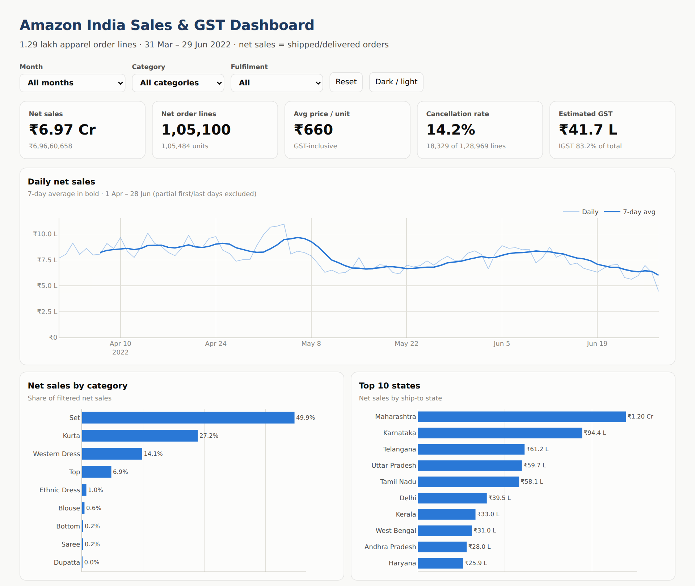
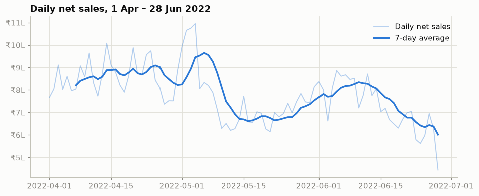
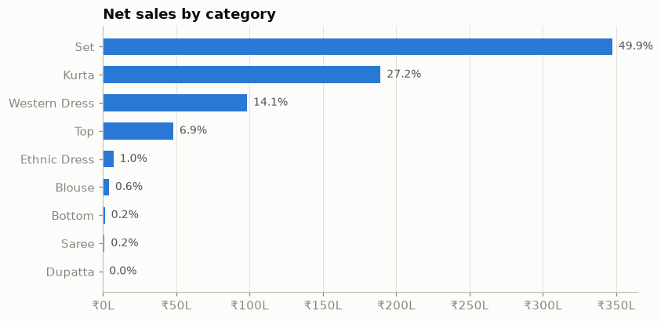
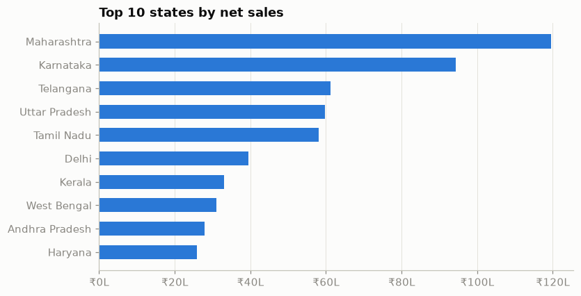
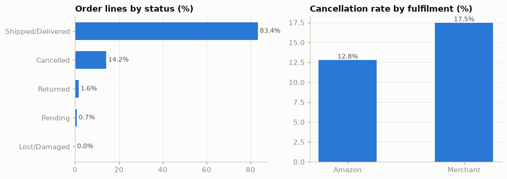
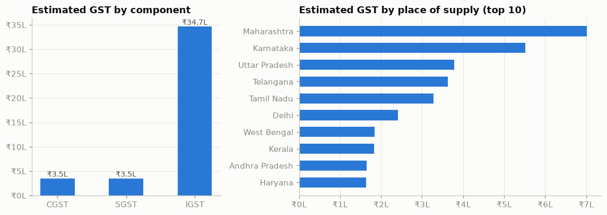

# Amazon India Sales & GST Analytics

End-to-end data analysis of **1,28,975 Amazon India apparel order lines (31 Mar – 29 Jun 2022)** using **Python, SQL and Excel**, with an **interactive dashboard**.
Besides the usual sales questions, the project adds an **accounting angle**: it estimates the seller's **GST liability by rate slab and by CGST / SGST / IGST**, the way an accounts team would prepare it.

**[Live dashboard](https://kmaan0786akwork-collab.github.io/amazon-india-sales-gst-analytics/)** · [Notebook](notebooks/sales_gst_analysis.ipynb) · [SQL results](sql/query_results.md) · [Excel report](excel/Sales_GST_Report.xlsx)



---

## Business questions

1. How much did the business really sell after cancellations and returns, and is it growing?
2. Which categories and states drive revenue?
3. Where are orders lost (cancellations, returns), and does the fulfilment method matter?
4. What is the estimated GST liability, by rate slab (5% / 12%) and by CGST / SGST / IGST?

## Key findings

| # | Finding |
|---|---------|
| 1 | **Net sales of ₹6.97 crore** from **97,965 orders** (1,05,484 units); average order value **₹711**. |
| 2 | **Sales per day fell 15.2% from April to June** (₹8.56 L/day → ₹7.26 L/day). |
| 3 | **Set and Kurta = 77%** of revenue (49.9% + 27.2%). |
| 4 | **Top 5 states = 56.4%** of sales — Maharashtra (17.2%), Karnataka, Telangana, Uttar Pradesh, Tamil Nadu. |
| 5 | **14.2% of order lines are cancelled.** Merchant-fulfilled (Easy Ship) orders cancel at **17.5%** vs **12.8%** for Amazon-fulfilled (FBA). |
| 6 | **Estimated GST ≈ ₹41.7 lakh.** **79.5%** of sales fall in the **5% slab**; **83.2%** of GST is **IGST** (inter-state supplies). |

## Recommendations

* **Reduce merchant-side cancellations** by moving top Set/Kurta SKUs to Amazon fulfilment (FBA).
* **Investigate the April → June decline** (stock-outs, pricing, ad spend) for the top two categories.
* **Concentrate marketing on the top 5 states** and test campaigns in the next tier (Delhi, Kerala, West Bengal).
* **GST:** keep most products priced at or below ₹1,000 per piece to stay in the 5% slab, and keep state-wise invoice data clean, since most of the tax is IGST.

## What I did

| Step | Tool | Output |
|---|---|---|
| Data quality checks & cleaning | Python (Pandas) | `src/clean_data.py` |
| Exploratory analysis & charts | Pandas, Matplotlib, Jupyter | `notebooks/sales_gst_analysis.ipynb`, `images/` |
| Business queries (CTEs, window functions) | SQL (SQLite) | `sql/queries.sql`, `sql/query_results.md` |
| GST report with live formulas | Excel (SUMIFS, INDEX/MATCH, IF) | `excel/Sales_GST_Report.xlsx` |
| Interactive dashboard with filters | Plotly.js, HTML/CSS | `docs/index.html` (GitHub Pages) |
| Automated, reproducible pipeline | GitHub Actions | `.github/workflows/build.yml` |

### Data cleaning

* Removed **6 exact duplicate** rows.
* `Amount` was missing on ~6% of rows — almost all **cancelled** orders — so it was set to 0 instead of dropping the rows.
* Grouped **13 raw order statuses** into 5 business groups: Shipped/Delivered, Cancelled, Returned, Pending, Lost/Damaged.
* Standardised **state names** (`RAJSHTHAN`, `RJ` → Rajasthan, `ORISSA` → Odisha, `NEW DELHI` → Delhi …) and **city names** (Bangalore → Bengaluru, Gurgaon → Gurugram …).
* Converted text dates (`MM-DD-YY`) to real dates; dropped empty / free-text columns (kept a simple *has_promotion* flag).
* **Net sales** = shipped or delivered lines with quantity ≥ 1 and amount > 0.

### GST method & assumptions

* Amounts are treated as **GST-inclusive** (Indian marketplace prices include GST).
* Apparel GST slabs in force in 2022 (HSN 61/62): **5%** if the price per piece is ≤ ₹1,000, otherwise **12%**.
* Taxable value = Amount ÷ (1 + rate); GST = Amount − taxable value.
* The seller's GST state is **not in the data**, so the seller is **assumed to be registered in Maharashtra**. Orders shipped within Maharashtra → CGST + SGST (half each); all other states → IGST. Change `SELLER_STATE` in `src/clean_data.py` or the yellow cell in the Excel *Assumptions* sheet to re-run with another state.
* These are **estimates for analysis practice**, not a tax filing.

### SQL highlights (`sql/queries.sql`)

12 queries, including month-over-month growth with `LAG()`, running revenue share with `SUM() OVER (ORDER BY …)`, top 3 cities per state with `ROW_NUMBER() OVER (PARTITION BY …)`, and a monthly GSTR-3B style CGST / SGST / IGST summary.

### Excel highlights (`excel/Sales_GST_Report.xlsx`)

* **Assumptions** sheet with editable GST threshold, rates and seller state — every other sheet recalculates.
* **State_GST** and **Monthly_GST**: `SUMIFS` by slab, taxable value, CGST / SGST / IGST via `IF` on place of supply.
* **Category** sheet and a **Summary** sheet (KPIs with `INDEX/MATCH` for top state and category).
* **Sales_Data** sheet with all 1,05,100 net-sale lines (filters and frozen header).

## Charts

| | |
|---|---|
|  |  |
|  |  |



## Project structure

```
amazon-india-sales-gst-analytics/
├── data/
│   ├── raw/amazon_sale_report.csv.gz        # original dataset (compressed)
│   └── processed/sales_clean.csv.gz         # cleaned + GST columns
├── notebooks/
│   ├── sales_gst_analysis.ipynb             # full analysis with outputs
│   └── sales_gst_analysis.py                # same notebook as a plain script (jupytext)
├── src/
│   ├── download_data.py                     # fetches the public dataset
│   ├── clean_data.py                        # cleaning + GST logic
│   ├── build_excel.py                       # builds the Excel GST report
│   ├── build_dashboard.py                   # builds docs/index.html
│   ├── dashboard_template.html
│   └── screenshot_dashboard.py              # README preview image
├── .github/workflows/build.yml              # runs the whole pipeline on every push
├── sql/
│   ├── queries.sql                          # 12 business queries
│   ├── run_queries.py                       # loads data into SQLite, runs queries
│   └── query_results.md                     # results
├── excel/Sales_GST_Report.xlsx              # formula-driven GST report
├── docs/                                    # interactive dashboard (GitHub Pages)
└── images/                                  # charts used in this README
```

## How to run

```bash
pip install -r requirements.txt
python src/download_data.py       # -> data/raw/amazon_sale_report.csv.gz
python src/clean_data.py          # -> data/processed/sales_clean.csv.gz
jupyter notebook notebooks/sales_gst_analysis.ipynb
python sql/run_queries.py         # -> sql/query_results.md
python src/build_excel.py         # -> excel/Sales_GST_Report.xlsx
python src/build_dashboard.py     # -> docs/index.html
```

The same steps run automatically in **GitHub Actions** on every push, and the generated files are committed back to the repo.

## Data source

“Amazon Sale Report” — public Amazon India e-commerce sales dataset published on Kaggle (*E-Commerce Sales Dataset*). Used here for learning and portfolio purposes only.

## Author

**Mohd Armaan** · [LinkedIn](https://www.linkedin.com/in/armaan-work) · [GitHub](https://github.com/kmaan0786akwork-collab)
